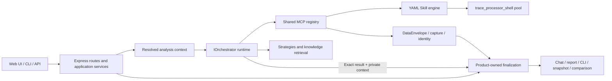

# SmartPerfetto 技术架构

[English](technical-architecture.en.md) | [中文](technical-architecture.md)

<!-- i18n-headings: paired -->

本文从实现边界解释当前 SmartPerfetto。快速入口见
[架构总览](overview.md)，runtime 细节见 [Agent Runtime](agent-runtime.md)，
表格和证据传输见 [Data Contract](../../backend/docs/DATA_CONTRACT_DESIGN.md)。

## 1. 产品不是单一 Web 插件

SmartPerfetto 在同一分析核心上提供多种入口：

| 产品面 | 入口 | 关键边界 |
|---|---|---|
| 源码 Web | `./start.sh` | 使用提交的 `frontend/`，普通用户不构建 Perfetto submodule |
| 前端开发 | `./scripts/start-dev.sh` | 只用于修改 AI Assistant plugin |
| Docker | `docker-compose.hub.yml` | 不读取宿主机 Claude Code 登录态 |
| npm CLI | `smp` / `smartperfetto` | Node.js `>=24 <25`，不包含 Web UI |
| portable | 三平台 release asset | 内置 Node.js 24、backend、frontend、trace processor 和 runtime assets |
| HTTP/SSE API | `/api/*` | Web、CLI 辅助服务和内部集成都复用后端 contract |

功能修改先判断影响哪些入口与共享契约，再验证对应行为。权威产品面清单在
[`.claude/rules/product-surface.md`](../../.claude/rules/product-surface.md)。

## 2. 组件边界



主要目录：

- `backend/src/routes/`：HTTP/SSE 路由与输入边界；
- `backend/src/assistant/application/`：session 准备和复用；
- `backend/src/agentRuntime/`：provider-neutral runtime 与输出收敛；
- `backend/src/agentv3/`：共享 MCP、策略加载、计划/verifier 等兼容命名空间；
- `backend/src/services/skillEngine/`：YAML Skill 执行；
- `backend/src/services/selfEvolution/`：RunManifest、反馈投影、eval/replay、
  提案、门控、overlay generation 和升级对账；
- `backend/src/services/externalIssueReporting/`：完成 run 的反馈机会检测、provider
  pin、无工具 triage、输出校验和 GitHub 草稿；
- `backend/skills/`：确定性 trace 证据程序；
- `backend/strategies/`：场景方法、prompt/template 和报告要求；
- `backend/src/services/traceProcessorService.ts`：trace processor 生命周期和租约；
- `perfetto/ui/src/plugins/com.smartperfetto.AIAssistant/`：Perfetto UI 插件源码；
- `frontend/`：源码、Docker 和 portable 实际消费的提交版 UI。

## 3. 一次分析的主流程

```text
POST /api/agent/v1/analyze
  -> AgentAnalyzeSessionService.prepareSession()
  -> 解析 workspace / user / trace / provider / source / knowledge context
  -> createAgentOrchestrator()
  -> 选择 Claude / OpenAI / Pi / OpenCode / Qoder runtime
  -> typed intent 固定范围、证据访问、预算和交付物
  -> 符合条件时由产品采集策略声明的场景入口证据
  -> 通过共享 MCP registry 调用 SQL、Skill、知识和计划工具
  -> 已选源码：有界 lookup 或结构化 SourceUseDecision stop
  -> DataEnvelope + evidence/claim/identity sidecar
  -> exact runtime result + private finalization context
  -> product-owned finalizeAnalysisResult：有限证明、最多一次无工具审核、终态
  -> SSE chat projection + HTML report + snapshot + CLI artifact
```

`options.analysisMode` 支持：

- `fast`：固定 quick budget，保留本次请求已授权的能力；
- `full`：固定 full budget；
- `auto`：采用 typed intent 的复杂度建议，不可用时使用明确 fallback。

预算、调查范围、证据访问和交付物是独立维度。完整预算不自动要求计划、报告或源码查询，
快速预算也不减少请求权限；`existing_only` 在工具处理边界禁止新采集。详见
[Agent Runtime](agent-runtime.md#分析模式)。

### 3.1 企业身份边界

`/api/auth/oidc/login` 和 callback 是公开 bootstrap 边界；其他 `/api` 默认经过统一
`authenticate` 中间件。`EnterpriseOidcClient` 用标准 discovery + Authorization
Code + PKCE，并在边界内完成 ID Token 与 nonce 校验。短期 state/nonce/PKCE
transaction 使用签名 HttpOnly Cookie；登录完成后只把不透明签名 session id 放入
HttpOnly Cookie，具体 tenant、workspace、role、scope 和撤销/到期状态仍从企业
SQLite 读取。

内置 OIDC 模式只信任标准化 Issuer 与 Subject：tenant 由 Issuer 稳定派生，user id 由
Issuer + Subject 派生。登录事务会自动创建或复用该用户唯一的个人工作区，
`sso_personal_workspaces` 映射和数据库 trigger 阻止其他用户加入。IdP tenant、workspace
或 role claim 都不能覆盖这条所有权边界。前端入口先完成 Session 门禁，再加载 Perfetto；
所有分析、Provider、codebase、trace 和 Trace Processor 心跳请求都通过共享的
credentialed fetch/header 策略携带 Cookie 与必要的 CSRF Token。本地缓存按
tenant/user/workspace 分区，OIDC 模式不读取旧的未分区数据。

Cookie 写请求除了 CORS 之外还要经过精确 Origin 检查，因为 CORS 本身不会阻止浏览器
发送跨站 mutation；同时必须携带 Session 派生的 CSRF Token。Trace Processor WebSocket
握手是 GET，且不经过 Express 中间件，所以由浏览器自动附带的凭据（Session Cookie、
可信 SSO Header、本地免密身份）认证时，握手的 Origin 必须在 CORS 允许列表中，并在
分配任何 lease holder 之前检查；不从 Host 推导后端自身 Origin，因为 DNS rebinding
页面能控制 Host。本地免密模式下握手同样拒绝非回环 Host。回调建立 Session 后直接
跳回 `FRONTEND_URL`，不使用 popup 或前端工作区选择流程。

## 4. Runtime 与 Provider

`PRODUCTION_RUNTIME_KINDS` 当前注册的 production runtime 都实现共享
`IOrchestrator` 合约：

| Runtime | 主要 Provider | 恢复状态 |
|---|---|---|
| `claude-agent-sdk` | Anthropic、Bedrock、Vertex、Claude-compatible | 不跨轮保留原生状态（只保留 provider 钉定） |
| `openai-agents-sdk` | OpenAI Responses、OpenAI-compatible、Ollama/chat-completions | 不跨轮保留原生状态（只保留 provider 钉定） |
| `pi-agent-core` | Provider Manager custom profile / Pi model config | 不跨轮保留原生状态（只保留 provider 钉定） |
| `opencode` | OpenCode SDK 与 custom provider | 不跨轮保留原生 session；隔离目录由 session id 推导，每轮复用 |
| `qoder-agent-sdk` | Qoder CLI 登录态或 PAT、custom provider | 不跨轮保留原生状态（只保留 provider 钉定） |

canonical loader 和 capabilities 来自
`backend/src/agentRuntime/runtimeDescriptors.ts`，具体实现在
`backend/src/agentRuntime/engines/`。`backend/src/agentOpenAI/` 是旧 import path
的 compatibility facade；`backend/src/agentv3/` 仍包含 canonical MCP、strategy、
planning 和 verifier shared layers，不能整体视为 legacy。

选择顺序是：请求显式 Provider Manager profile、持久化 session snapshot、
`SMARTPERFETTO_AGENT_RUNTIME`、默认 runtime。session 创建后固定 provider/runtime；
恢复时不能因为当前 active profile 改变而静默换 provider。

Provider Manager profile 优先于 `.env` fallback。Claude Agent SDK 在所有运行方式下
都需要显式 provider/env 凭据；Claude Code 登录态不代表 SDK 已配置。

## 5. MCP 工具面

`backend/src/agentv3/mcpToolRegistry.ts` 是工具描述、exposure 和 allowlist 的注册源，
`claudeMcpServer.ts` 提供实现与按请求组合。工具不是固定总数：

- quick budget 在非整场景调查时压缩工具目录与结果投影，权限仍由请求和处理边界决定；
- code-aware 工具需要授权；
- comparison 工具只在 reference trace 存在时注册；
- artifact 工具依赖当前 session 能力；
- deprecated 或内部工具不会自动成为公开契约。

公开文档应说明工具家族和可见性，不复制静态数量或手工维护另一份 registry。
完整说明见 [MCP 工具参考](../reference/mcp-tools.md)。

## 6. Strategy 与 Skill

两类内容职责不同：

```text
Markdown Strategy / Template
  -> 分类、方法、investigation_requirements、entry_skill、final_report_contract

YAML Skill
  -> SQL / iterator / conditional / composite execution
  -> deterministic DataEnvelope evidence
```

长期 prompt 内容不写入 TypeScript。新增场景方法修改 `backend/strategies/`；
新增确定性证据修改 `backend/skills/`。Skill 数量、场景列表和 pipeline catalog 都从
文件树/frontmatter/index 发现，不能在代码或文档中固定复制。

渲染管线教学内容位于 `docs/rendering_pipelines/`，运行时通过 `doc_path` 读取。
这些文件由同步工具从固定来源更新，不手工编辑：

```bash
npm run sync:rendering-pipelines -- --source <checkout> --apply
npm run check:rendering-pipelines
```

Skill 合约见 [Skill 系统指南](../reference/skill-system.md)。

## 7. Trace Processor 与证据

`TraceProcessorService` 管理 `trace_processor_shell` pool、端口租约、trace load 和 SQL
RPC。源码启动、npm、Docker 和 portable 必须使用同一 pin/校验规则；显式
`TRACE_PROCESSOR_PATH` 是用户拥有的覆盖路径，启动器不会替用户改权限或覆盖文件。

processor 的生命周期绑定到启动它的进程。macOS 和 Linux 上以
`server http --idle-start orphaned` 启动，owner 退出后很快自行退出，包括不执行任何清理的退出
（SIGKILL、崩溃、`jest --forceExit`）。Windows 和以 PID 1 运行的后端以不绑定 owner 的
`server http` 启动，没有 `server http` 的二进制用经典 `--httpd` 启动；这些情况下 owner 死后
遗留的 processor 由下一次后端启动的孤儿清扫回收。

Skill/SQL 输出经过 DataEnvelope 后会继续形成：

- evidence contract；
- deterministic claim verification；
- process/thread identity resolution；
- report provenance；
- analysis-result snapshot；
- comparison metric。

聊天可读性与审计来源是分离产品面。隐藏聊天中的 raw SQL 不能删除报告、snapshot 或
CLI artifact 中用于复核的 provenance。

## 8. 两种对比产品

SmartPerfetto 维护两类不同对比：

1. **Raw trace comparison**：同一 workspace 任意选择基线 + 对比 trace，在同一 AI session 中实时查询；API 兼容角色仍为 current + reference。
   CLI `smp compare` 与双窗 UI 复用后端 comparison context、Skill 和报告 section。
2. **Analysis-result comparison**：比较已持久化 snapshot，可跨窗口、跨 trace，
   并受 workspace/RBAC/share 规则约束。

两者可以共享标准指标和报告 section，但不能把 raw trace 对比实现成 UI/CLI 私有 prompt，
也不能把 snapshot comparison 与任意两条 raw trace 的实时双窗混为一谈。

## 9. 源码与知识上下文

### Code-Aware

代码库先经过 `PathSecurityGate` preview/register/reindex。默认 `metadata_only` 只向
模型提供 `CodeRef`；`provider_send` 还需要注册时同意和本次请求显式选择。
经过 owner 授权的结果投影可保留分析中的源码引用，供用户界面、本地历史和报告读取；
日志、公开及共享出口使用 strict 投影。敏感路径、凭据与授权撤销仍独立检查，具体边界见
[私有分析上下文](private-analysis-context.md)。

注册只使代码库可选，不会自动附加。live root 的 `search_codebase` /
`read_codebase_file` 不要求 active index；reindex 只是语义/符号检索和 patch 流程
的可选加速。源码访问按问题与 `sourceNeed` 需要进行，预算档不自动插入 lookup；
`existing_only` 不允许补采集。`SourceUseDecisionV1` 记录实际 selected/queried/used、status 和 coverage。

Trace/Skill/SQL 支撑观测，源码正文支持机制分析，`CodeRef` 元数据只负责定位。
`SourceClaimBindingV1` 声明 claim 与 source/trace 引用的关联，状态由
`source_claim_verifier@2` 从实际账本计算：`invalid` 表示绑定无效，`unbound`、
`location_only`、`source_only` 保持 partial；`trace_linked` 表示本轮读过正文，且已关联
同一 claim 的已核验 Trace 证据，不单独证明一般机制或因果关系。一个
canonical projector 负责 SSE、report、CLI、snapshot 和 API 的安全 provenance；Web 再缩减为
当前 run 回执。

### 文档知识库

知识只有一种来源：用户注册并逐轮选择的文档知识库（`document_collection`），包括
Android Internals Wiki 的 `src/`。它需要路径 allowlist（或本机目录选择）、权利确认、
provider 同意和激活索引；`search_knowledge` / `read_knowledge_section` 的结果是背景
（`evidenceEffect: background`），用 `kref-` 引用和 `kb:` 出处，不能伪装成当前 trace 证据。
旧版 Wiki 连接器的记录是退役 kind：可列出、可删除，启动门禁以
`ANALYSIS_CONTEXT_SOURCE_RETIRED` 拒绝选用。

统一 analysis context 会固定 codebase/knowledge generation、tenant/workspace/user、
provider consent 和 session continuity。恢复、报告和 snapshot 不能绕过这些边界。

## 10. Self-Evolution 数据与发布路径

在线分析和进化发布通过 immutable identity 解耦：

```text
RunManifest + effective public feedback
  -> bounded curation proposal
  -> materialized treatment
  -> validation/holdout paired replay
  -> qualified + accepted proposal
  -> content-addressed overlay artifact
  -> atomic generation pointer
  -> immutable effective registry snapshot for each new run
```

事实存储分工明确：feedback JSONL 是事实源，SQLite 是可重建投影；eval case、
replay、proposal/gate attempt、overlay registry 和 reconciliation 分别保存版本化
artifact 与绑定关系。private feedback 使用独立路径，策展读取端不会打开它。

发布不是原地修改全局 Skill registry。一个 run seal 后始终使用同一 snapshot；新
generation 只供新 run 解析。apply/revert 通过幂等 action saga 发布，启动/升级通过
build identity 和 base fingerprint 对账。持久化能力、门控绑定或对账失败时
fail-closed。用户操作和验证见
[Self-Evolution 指南](../getting-started/self-evolution.md)。

## 10A. Agent 辅助外部反馈

```text
persisted analysis_completed + RunManifest + optional snapshot
  -> deterministic opportunity signals
  -> explicit user action
  -> same provider/runtime snapshot, no-tool triage
  -> strict reference/trust/content validation
  -> user answers + sensitive-data confirmation
  -> deidentified notSubmitted GitHub draft
```

源解析按 `(tenant, workspace, sessionId, runId, runManifestId, snapshotId)` 交叉校验，
不会使用当前 session 的 result 或触发 completed recovery。`providerSnapshotHash`
把 review 绑定到源 run；pin 缺失、变化或不支持时只返回确定性验证建议。
`publicArtifactSanitizer` 是 M9 contribution bundle 与 M10 草稿共享的中立公开边界，
但两条业务状态机互不调用。详见
[Agent 辅助 GitHub 反馈](../getting-started/agent-assisted-feedback.md)。

## 11. 输出与持久化

最终输出不是单一 Markdown 字符串：

| 产品面 | 保留内容 |
|---|---|
| SSE / AI chat | 可读结论、必要证据摘要和进度 |
| HTML report | 证据、claim、identity、背景知识引用和 appendix |
| CLI artifact | turn、report、resume state 和机器可读输出 |
| analysis-result snapshot | 标准指标、证据引用、comparison 输入 |
| logical session snapshot | provider/runtime 钉定与产品历史，不跨轮恢复原生 SDK 会话 |
| source provenance | 安全 SourceUseDecision、相对 `CodeRef` 与 trace-to-mechanism binding；Web 回执不保留 `CodeRef` |

产品层从 exact runtime result 取出私有上下文，再唯一调用 `finalizeAnalysisResult`。
它保留原命题和采集来源，分别计算完成、声明、证据、源码、身份及报告状态；
声明按条目核验，交付模型调用按剩余时间准入。细节见 [Agent Runtime](agent-runtime.md#final-result-与质量产物)。

## 12. 发布资产

发布面彼此独立：

- npm CLI 包含 CLI dist、Skills、Strategies、SQL 和 trace processor；
- portable 还包含 Node.js 24、原生依赖、backend、`frontend/` 和 launcher；
- Docker 从 `main` 构建 Linux image，消费提交的 `frontend/` 和 runtime assets；
- 源码 checkout 的普通路径也消费 `frontend/`，只有 UI 开发才构建 submodule。

发布顺序、签名和 smoke 见 [发布手册](../reference/release.md) 与
[portable 打包](../reference/portable-packaging.md)。

## 13. 验证策略

最小验证由改动类型决定，完整合入门禁是：

```bash
npm run verify:docs
npm run verify:pr
```

关键专项入口：

```bash
cd backend
npm run validate:skills
npm run validate:strategies
npm run test:report-contracts
npm run test:source-claim-contract
npm run verify:code-aware-semantic-delta
npm run test:self-evolution
npm run test:scene-trace-regression
npm run cli:pack-check
npm run verify:codebase-aware
```

此外：

- 双 Trace 浏览器契约：`npm run test:e2e:dual-trace`；
- trace corpus：`npm run trace:regression`；
- runtime-read 渲染文档：`npm run verify:rendering-pipelines`；
- portable：按 [测试规则](../../.claude/rules/testing.md) 运行脚本静态检查、
  launcher cross-build、全包构建和 manifest 校验；
- provider-backed E2E 只有安全凭证存在时运行，不能用单测冒充真实模型验证；
- Android capture 只有连接真实设备时才能声明抓取 smoke 通过，离线只证明
  proposal/config/CLI contract。

## 14. 修改位置速查

| 目标 | 修改位置 |
|---|---|
| 新增确定性分析 | `backend/skills/` |
| 修改 AI 方法或报告要求 | `backend/strategies/` |
| 新增/修改 MCP 工具 | registry + implementation + reference + tests |
| 修改 DataEnvelope | backend source + generator + frontend generated types + consumers |
| 修改 API contract | route/application service + tests + API 文档 |
| 修改 AI Assistant UI | Perfetto plugin source + dev/browser test + `frontend/` prebuild |
| 修改源码使用决策/结论 provenance | source policy + MCP ledger/finalizer + claim binding + report/CLI/snapshot/Web 投影 + 语义 gate |
| 修改 runtime/provider | `agentRuntime/` + Provider Manager + session snapshot tests |
| 修改 Self-Evolution | `services/selfEvolution/` + admin routes/UI + focused tests + current contract docs |
| 修改 Agent 外部反馈 | `services/externalIssueReporting/` + agent route + AI plugin + Issue Form + `test:external-issue-reporting` |
| 修改发布资产 | package/release scripts + runtime-asset tests + release docs |

架构修改完成后，再按
[`AGENTS.md`](../../AGENTS.md) 和 `.claude/rules/` 中对应规则选择验证层级。
